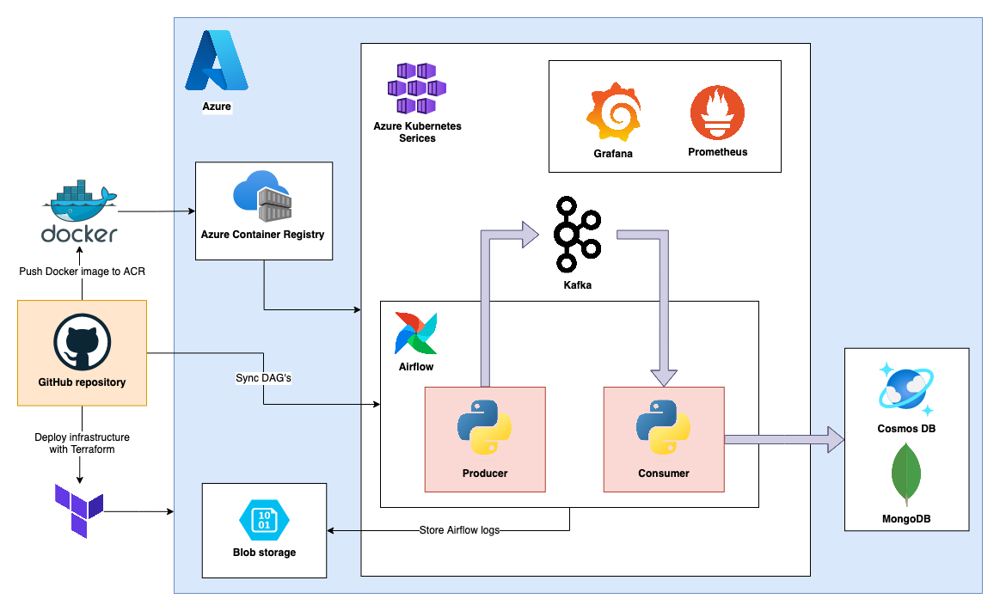

# kafka-dev


---



## Prerequisites

- You have [az cli](https://learn.microsoft.com/en-us/cli/azure/install-azure-cli) installed.
- You have kubectl installed with [`az aks install-cli`](https://learn.microsoft.com/en-us/azure/aks/learn/quick-kubernetes-deploy-cli#connect-to-the-cluster).

## Installation

Follow the installation instructions in the README's of these directories in order:

- [terraform](./terraform/README.md#installation)
- [kafka](./kafka/README.md#installation)
- [airflow](./airflow/README.md#installation)
- [python](./python/README.md)

When this is done, open the Airflow UI with

```sh
kubectl port-forward svc/airflow-webserver 8080:8080 -n airflow
```

and trigger the DAG's manually.
